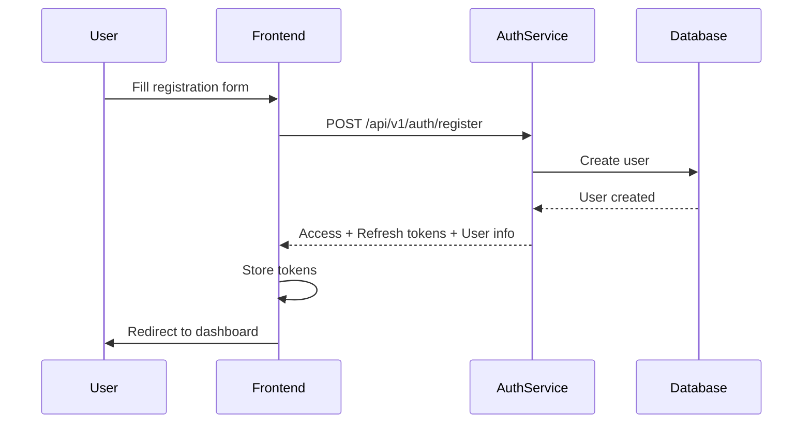
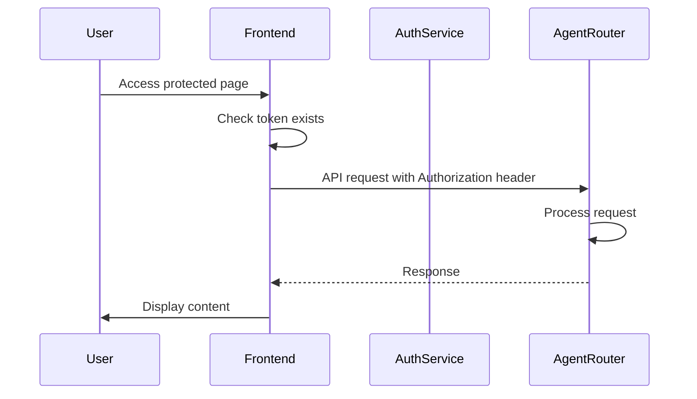
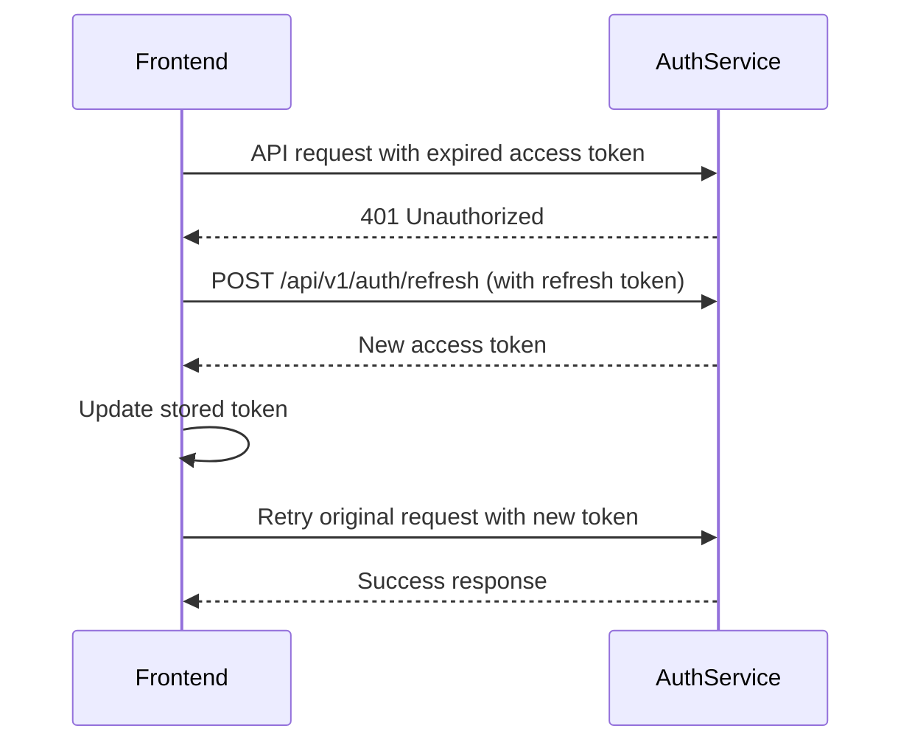

# Frontend Integration Guide - Auth Service

This guide provides everything the frontend team needs to integrate with the authentication service.

## 📋 Table of Contents
- [Service Information](#service-information)
- [API Endpoints](#api-endpoints)
- [Authentication Flow](#authentication-flow)
- [Implementation Examples](#implementation-examples)
- [Token Management](#token-management)
- [Error Handling](#error-handling)
- [TypeScript Types](#typescript-types)

---

## 🌐 Service Information

### Base URLs

| Environment | URL |
|-------------|-----|
| Development | `http://localhost:8001` |
| Production | `https://auth.yourdomain.com` (to be configured) |

### CORS Configuration

The auth service is configured to accept requests from:
- `http://localhost:3000`
- `http://localhost:3001`

For production, update `CORS_ORIGINS` in the auth service configuration.

---

## 🔌 API Endpoints

### 1. **User Registration**

**Endpoint:** `POST /api/v1/auth/register`

**Request Body:**
```json
{
  "email": "user@example.com",
  "password": "securePassword123",
  "full_name": "John Doe",
  "username": "johndoe"
}
```

**Response (201 Created):**
```json
{
  "access_token": "eyJhbGciOiJIUzI1NiIsInR5cCI6IkpXVCJ9...",
  "refresh_token": "eyJhbGciOiJIUzI1NiIsInR5cCI6IkpXVCJ9...",
  "token_type": "bearer",
  "user": {
    "id": "69a65abb05f3e45f0edfe00c",
    "email": "user@example.com",
    "username": "johndoe",
    "full_name": "John Doe",
    "is_active": true,
    "is_verified": true,
    "created_at": "2026-03-03T03:51:23.360000",
    "roles": ["user"]
  },
  "message": "User registered successfully"
}
```

**Validation Rules:**
- `email`: Valid email format (required)
- `password`: Minimum 8 characters (required)
- `full_name`: Optional string
- `username`: Optional string (must be unique if provided)

**Error Responses:**
- `400 Bad Request`: Invalid input or email already exists
- `422 Unprocessable Entity`: Validation errors

---

### 2. **User Login**

**Endpoint:** `POST /api/v1/auth/login`

**Request Body:**
```json
{
  "email": "user@example.com",
  "password": "securePassword123"
}
```

**Response (200 OK):**
```json
{
  "access_token": "eyJhbGciOiJIUzI1NiIsInR5cCI6IkpXVCJ9...",
  "refresh_token": "eyJhbGciOiJIUzI1NiIsInR5cCI6IkpXVCJ9...",
  "token_type": "bearer",
  "user": {
    "id": "69a65abb05f3e45f0edfe00c",
    "email": "user@example.com",
    "username": "johndoe",
    "full_name": "John Doe",
    "is_active": true,
    "is_verified": true,
    "created_at": "2026-03-03T03:51:23.360000",
    "roles": ["user"]
  }
}
```

**Error Responses:**
- `401 Unauthorized`: Invalid credentials
- `403 Forbidden`: Account is inactive

---

### 3. **Get Current User**

**Endpoint:** `GET /api/v1/auth/me`

**Headers:**
```
Authorization: Bearer <access_token>
```

**Response (200 OK):**
```json
{
  "id": "69a65abb05f3e45f0edfe00c",
  "email": "user@example.com",
  "username": "johndoe",
  "full_name": "John Doe",
  "is_active": true,
  "is_verified": true,
  "created_at": "2026-03-03T03:51:23.360000",
  "roles": ["user"]
}
```

**Error Responses:**
- `401 Unauthorized`: Invalid or expired token
- `403 Forbidden`: Account is inactive

---

### 4. **Refresh Access Token**

**Endpoint:** `POST /api/v1/auth/refresh`

**Headers:**
```
Authorization: Bearer <refresh_token>
```

**Response (200 OK):**
```json
{
  "access_token": "eyJhbGciOiJIUzI1NiIsInR5cCI6IkpXVCJ9...",
  "token_type": "bearer"
}
```

**Error Responses:**
- `401 Unauthorized`: Invalid or expired refresh token

---

### 5. **Logout**

**Endpoint:** `POST /api/v1/auth/logout`

**Headers:**
```
Authorization: Bearer <access_token>
```

**Response (200 OK):**
```json
{
  "message": "Successfully logged out"
}
```

**Note:** Since we use stateless JWT tokens, logout is primarily handled client-side by removing tokens from storage.

---

### 6. **Verify Token** (For Internal Use)

**Endpoint:** `POST /api/v1/auth/verify`

**Request Body:**
```json
{
  "token": "eyJhbGciOiJIUzI1NiIsInR5cCI6IkpXVCJ9..."
}
```

**Response (200 OK):**
```json
{
  "valid": true,
  "user_id": "69a65abb05f3e45f0edfe00c",
  "email": "user@example.com",
  "roles": ["user"],
  "message": null
}
```

---

### 7. **Health Check**

**Endpoint:** `GET /health`

**Response (200 OK):**
```json
{
  "status": "healthy",
  "service": "auth-service",
  "database": "connected"
}
```

---

## 🔄 Authentication Flow

### Registration Flow



### Login Flow


### Protected Route Access



### Token Refresh Flow



---

## 💻 Implementation Examples

### React/Next.js Implementation

#### 1. API Service Layer (`lib/api/auth.ts`)

```typescript
const AUTH_SERVICE_URL = process.env.NEXT_PUBLIC_AUTH_SERVICE_URL || 'http://localhost:8001';

export interface RegisterRequest {
  email: string;
  password: string;
  full_name?: string;
  username?: string;
}

export interface LoginRequest {
  email: string;
  password: string;
}

export interface AuthResponse {
  access_token: string;
  refresh_token: string;
  token_type: string;
  user: User;
  message?: string;
}

export interface User {
  id: string;
  email: string;
  username: string | null;
  full_name: string | null;
  is_active: boolean;
  is_verified: boolean;
  created_at: string;
  roles: string[];
}

export interface TokenRefreshResponse {
  access_token: string;
  token_type: string;
}

class AuthAPI {
  private baseURL: string;

  constructor() {
    this.baseURL = AUTH_SERVICE_URL;
  }

  async register(data: RegisterRequest): Promise<AuthResponse> {
    const response = await fetch(`${this.baseURL}/api/v1/auth/register`, {
      method: 'POST',
      headers: {
        'Content-Type': 'application/json',
      },
      body: JSON.stringify(data),
    });

    if (!response.ok) {
      const error = await response.json();
      throw new Error(error.detail || 'Registration failed');
    }

    return response.json();
  }

  async login(data: LoginRequest): Promise<AuthResponse> {
    const response = await fetch(`${this.baseURL}/api/v1/auth/login`, {
      method: 'POST',
      headers: {
        'Content-Type': 'application/json',
      },
      body: JSON.stringify(data),
    });

    if (!response.ok) {
      const error = await response.json();
      throw new Error(error.detail || 'Login failed');
    }

    return response.json();
  }

  async getCurrentUser(token: string): Promise<User> {
    const response = await fetch(`${this.baseURL}/api/v1/auth/me`, {
      method: 'GET',
      headers: {
        'Authorization': `Bearer ${token}`,
      },
    });

    if (!response.ok) {
      const error = await response.json();
      throw new Error(error.detail || 'Failed to get user info');
    }

    return response.json();
  }

  async refreshToken(refreshToken: string): Promise<TokenRefreshResponse> {
    const response = await fetch(`${this.baseURL}/api/v1/auth/refresh`, {
      method: 'POST',
      headers: {
        'Authorization': `Bearer ${refreshToken}`,
      },
    });

    if (!response.ok) {
      const error = await response.json();
      throw new Error(error.detail || 'Token refresh failed');
    }

    return response.json();
  }

  async logout(token: string): Promise<void> {
    await fetch(`${this.baseURL}/api/v1/auth/logout`, {
      method: 'POST',
      headers: {
        'Authorization': `Bearer ${token}`,
      },
    });
  }

  async checkHealth(): Promise<{ status: string; service: string; database: string }> {
    const response = await fetch(`${this.baseURL}/health`);
    return response.json();
  }
}

export const authAPI = new AuthAPI();
```

---

#### 2. Authentication Context (`contexts/AuthContext.tsx`)

```typescript
'use client';

import { createContext, useContext, useState, useEffect, ReactNode } from 'react';
import { authAPI, User, RegisterRequest, LoginRequest } from '@/lib/api/auth';

interface AuthContextType {
  user: User | null;
  accessToken: string | null;
  isLoading: boolean;
  isAuthenticated: boolean;
  login: (credentials: LoginRequest) => Promise<void>;
  register: (data: RegisterRequest) => Promise<void>;
  logout: () => Promise<void>;
  refreshAuth: () => Promise<void>;
}

const AuthContext = createContext<AuthContextType | undefined>(undefined);

export function AuthProvider({ children }: { children: ReactNode }) {
  const [user, setUser] = useState<User | null>(null);
  const [accessToken, setAccessToken] = useState<string | null>(null);
  const [isLoading, setIsLoading] = useState(true);

  // Initialize auth state from localStorage
  useEffect(() => {
    const initAuth = async () => {
      try {
        const storedToken = localStorage.getItem('access_token');

        if (storedToken) {
          // Verify token is still valid by fetching user info
          const userData = await authAPI.getCurrentUser(storedToken);
          setUser(userData);
          setAccessToken(storedToken);
        }
      } catch (error) {
        // Token is invalid or expired, try to refresh
        const refreshToken = localStorage.getItem('refresh_token');

        if (refreshToken) {
          try {
            const { access_token } = await authAPI.refreshToken(refreshToken);
            const userData = await authAPI.getCurrentUser(access_token);

            setUser(userData);
            setAccessToken(access_token);
            localStorage.setItem('access_token', access_token);
          } catch (refreshError) {
            // Refresh failed, clear tokens
            localStorage.removeItem('access_token');
            localStorage.removeItem('refresh_token');
          }
        }
      } finally {
        setIsLoading(false);
      }
    };

    initAuth();
  }, []);

  const login = async (credentials: LoginRequest) => {
    try {
      const response = await authAPI.login(credentials);

      setUser(response.user);
      setAccessToken(response.access_token);

      // Store tokens
      localStorage.setItem('access_token', response.access_token);
      localStorage.setItem('refresh_token', response.refresh_token);
    } catch (error) {
      throw error;
    }
  };

  const register = async (data: RegisterRequest) => {
    try {
      const response = await authAPI.register(data);

      setUser(response.user);
      setAccessToken(response.access_token);

      // Store tokens
      localStorage.setItem('access_token', response.access_token);
      localStorage.setItem('refresh_token', response.refresh_token);
    } catch (error) {
      throw error;
    }
  };

  const logout = async () => {
    try {
      if (accessToken) {
        await authAPI.logout(accessToken);
      }
    } catch (error) {
      console.error('Logout error:', error);
    } finally {
      // Clear local state and storage
      setUser(null);
      setAccessToken(null);
      localStorage.removeItem('access_token');
      localStorage.removeItem('refresh_token');
    }
  };

  const refreshAuth = async () => {
    const refreshToken = localStorage.getItem('refresh_token');

    if (!refreshToken) {
      throw new Error('No refresh token available');
    }

    try {
      const { access_token } = await authAPI.refreshToken(refreshToken);
      const userData = await authAPI.getCurrentUser(access_token);

      setUser(userData);
      setAccessToken(access_token);
      localStorage.setItem('access_token', access_token);
    } catch (error) {
      // Refresh failed, log out user
      await logout();
      throw error;
    }
  };

  return (
    <AuthContext.Provider
      value={{
        user,
        accessToken,
        isLoading,
        isAuthenticated: !!user,
        login,
        register,
        logout,
        refreshAuth,
      }}
    >
      {children}
    </AuthContext.Provider>
  );
}

export function useAuth() {
  const context = useContext(AuthContext);
  if (context === undefined) {
    throw new Error('useAuth must be used within an AuthProvider');
  }
  return context;
}
```

---

#### 3. Protected Route Component (`components/ProtectedRoute.tsx`)

```typescript
'use client';

import { useEffect } from 'react';
import { useRouter } from 'next/navigation';
import { useAuth } from '@/contexts/AuthContext';

interface ProtectedRouteProps {
  children: React.ReactNode;
  requiredRoles?: string[];
}

export function ProtectedRoute({ children, requiredRoles = [] }: ProtectedRouteProps) {
  const { isAuthenticated, isLoading, user } = useAuth();
  const router = useRouter();

  useEffect(() => {
    if (!isLoading && !isAuthenticated) {
      router.push('/login');
    }

    // Check roles if specified
    if (!isLoading && isAuthenticated && requiredRoles.length > 0) {
      const hasRequiredRole = requiredRoles.some(role => user?.roles.includes(role));

      if (!hasRequiredRole) {
        router.push('/unauthorized');
      }
    }
  }, [isAuthenticated, isLoading, user, requiredRoles, router]);

  if (isLoading) {
    return (
      <div className="flex items-center justify-center min-h-screen">
        <div className="animate-spin rounded-full h-12 w-12 border-b-2 border-gray-900" />
      </div>
    );
  }

  if (!isAuthenticated) {
    return null;
  }

  return <>{children}</>;
}
```

---

#### 4. Login Page Example (`app/login/page.tsx`)

```typescript
'use client';

import { useState } from 'react';
import { useRouter } from 'next/navigation';
import { useAuth } from '@/contexts/AuthContext';

export default function LoginPage() {
  const [email, setEmail] = useState('');
  const [password, setPassword] = useState('');
  const [error, setError] = useState('');
  const [isLoading, setIsLoading] = useState(false);

  const { login } = useAuth();
  const router = useRouter();

  const handleSubmit = async (e: React.FormEvent) => {
    e.preventDefault();
    setError('');
    setIsLoading(true);

    try {
      await login({ email, password });
      router.push('/dashboard');
    } catch (err) {
      setError(err instanceof Error ? err.message : 'Login failed');
    } finally {
      setIsLoading(false);
    }
  };

  return (
    <div className="min-h-screen flex items-center justify-center bg-gray-50">
      <div className="max-w-md w-full space-y-8 p-8 bg-white rounded-lg shadow">
        <div>
          <h2 className="text-center text-3xl font-extrabold text-gray-900">
            Sign in to your account
          </h2>
        </div>

        <form className="mt-8 space-y-6" onSubmit={handleSubmit}>
          {error && (
            <div className="rounded-md bg-red-50 p-4">
              <p className="text-sm text-red-800">{error}</p>
            </div>
          )}

          <div className="rounded-md shadow-sm -space-y-px">
            <div>
              <label htmlFor="email" className="sr-only">Email address</label>
              <input
                id="email"
                name="email"
                type="email"
                required
                value={email}
                onChange={(e) => setEmail(e.target.value)}
                className="appearance-none rounded-none relative block w-full px-3 py-2 border border-gray-300 placeholder-gray-500 text-gray-900 rounded-t-md focus:outline-none focus:ring-indigo-500 focus:border-indigo-500 focus:z-10 sm:text-sm"
                placeholder="Email address"
              />
            </div>
            <div>
              <label htmlFor="password" className="sr-only">Password</label>
              <input
                id="password"
                name="password"
                type="password"
                required
                value={password}
                onChange={(e) => setPassword(e.target.value)}
                className="appearance-none rounded-none relative block w-full px-3 py-2 border border-gray-300 placeholder-gray-500 text-gray-900 rounded-b-md focus:outline-none focus:ring-indigo-500 focus:border-indigo-500 focus:z-10 sm:text-sm"
                placeholder="Password"
              />
            </div>
          </div>

          <div>
            <button
              type="submit"
              disabled={isLoading}
              className="group relative w-full flex justify-center py-2 px-4 border border-transparent text-sm font-medium rounded-md text-white bg-indigo-600 hover:bg-indigo-700 focus:outline-none focus:ring-2 focus:ring-offset-2 focus:ring-indigo-500 disabled:opacity-50"
            >
              {isLoading ? 'Signing in...' : 'Sign in'}
            </button>
          </div>
        </form>
      </div>
    </div>
  );
}
```

---

#### 5. API Client with Auto-Refresh (`lib/api/client.ts`)

```typescript
import { authAPI } from './auth';

interface RequestConfig extends RequestInit {
  requiresAuth?: boolean;
}

class APIClient {
  private baseURL: string;

  constructor(baseURL: string) {
    this.baseURL = baseURL;
  }

  async request<T>(endpoint: string, config: RequestConfig = {}): Promise<T> {
    const { requiresAuth = true, ...fetchConfig } = config;

    // Add auth header if required
    if (requiresAuth) {
      const accessToken = localStorage.getItem('access_token');

      if (accessToken) {
        fetchConfig.headers = {
          ...fetchConfig.headers,
          'Authorization': `Bearer ${accessToken}`,
        };
      }
    }

    try {
      const response = await fetch(`${this.baseURL}${endpoint}`, fetchConfig);

      // Handle 401 - Token expired
      if (response.status === 401 && requiresAuth) {
        // Try to refresh token
        const refreshToken = localStorage.getItem('refresh_token');

        if (refreshToken) {
          try {
            const { access_token } = await authAPI.refreshToken(refreshToken);
            localStorage.setItem('access_token', access_token);

            // Retry original request with new token
            fetchConfig.headers = {
              ...fetchConfig.headers,
              'Authorization': `Bearer ${access_token}`,
            };

            const retryResponse = await fetch(`${this.baseURL}${endpoint}`, fetchConfig);

            if (!retryResponse.ok) {
              throw new Error(`HTTP ${retryResponse.status}: ${retryResponse.statusText}`);
            }

            return retryResponse.json();
          } catch (refreshError) {
            // Refresh failed, redirect to login
            localStorage.removeItem('access_token');
            localStorage.removeItem('refresh_token');
            window.location.href = '/login';
            throw refreshError;
          }
        } else {
          // No refresh token, redirect to login
          window.location.href = '/login';
          throw new Error('Authentication required');
        }
      }

      if (!response.ok) {
        const error = await response.json();
        throw new Error(error.detail || `HTTP ${response.status}: ${response.statusText}`);
      }

      return response.json();
    } catch (error) {
      console.error('API request failed:', error);
      throw error;
    }
  }

  async get<T>(endpoint: string, config?: RequestConfig): Promise<T> {
    return this.request<T>(endpoint, { ...config, method: 'GET' });
  }

  async post<T>(endpoint: string, data?: any, config?: RequestConfig): Promise<T> {
    return this.request<T>(endpoint, {
      ...config,
      method: 'POST',
      headers: {
        'Content-Type': 'application/json',
        ...config?.headers,
      },
      body: data ? JSON.stringify(data) : undefined,
    });
  }

  async put<T>(endpoint: string, data?: any, config?: RequestConfig): Promise<T> {
    return this.request<T>(endpoint, {
      ...config,
      method: 'PUT',
      headers: {
        'Content-Type': 'application/json',
        ...config?.headers,
      },
      body: data ? JSON.stringify(data) : undefined,
    });
  }

  async delete<T>(endpoint: string, config?: RequestConfig): Promise<T> {
    return this.request<T>(endpoint, { ...config, method: 'DELETE' });
  }
}

// Create client instances
export const agentRouterClient = new APIClient(
  process.env.NEXT_PUBLIC_AGENT_ROUTER_URL || 'http://localhost:8000'
);

export const authClient = new APIClient(
  process.env.NEXT_PUBLIC_AUTH_SERVICE_URL || 'http://localhost:8001'
);
```

---

## 🔐 Token Management

### Token Storage Options

#### Option 1: localStorage (Easier, Less Secure)

**Pros:**
- Simple implementation
- Works across tabs
- Easy to debug

**Cons:**
- Vulnerable to XSS attacks
- Tokens persist until manually cleared

**Implementation:**
```typescript
// Store tokens
localStorage.setItem('access_token', accessToken);
localStorage.setItem('refresh_token', refreshToken);

// Retrieve tokens
const accessToken = localStorage.getItem('access_token');
const refreshToken = localStorage.getItem('refresh_token');

// Remove tokens
localStorage.removeItem('access_token');
localStorage.removeItem('refresh_token');
```

#### Option 2: HTTP-only Cookies (More Secure)

**Pros:**
- Protected from XSS attacks
- Automatic inclusion in requests
- Better security

**Cons:**
- Requires backend cookie handling
- CSRF protection needed
- Harder to implement with separate auth service

**Note:** For the current setup with a separate auth service, localStorage is recommended. For production, consider migrating to HTTP-only cookies with proper CSRF protection.

### Token Expiration

- **Access Token:** 30 minutes
- **Refresh Token:** 7 days

Implement automatic token refresh before access token expires to provide seamless user experience.

---

## ⚠️ Error Handling

### Common Error Codes

| Status Code | Description | Handling Strategy |
|-------------|-------------|-------------------|
| `400` | Bad Request | Show validation errors to user |
| `401` | Unauthorized | Refresh token or redirect to login |
| `403` | Forbidden | Show "Access Denied" message |
| `404` | Not Found | Show "Resource not found" |
| `422` | Validation Error | Show field-specific errors |
| `500` | Server Error | Show generic error, log to monitoring |

### Error Response Format

```json
{
  "detail": "Error message here"
}
```

or for validation errors:

```json
{
  "detail": [
    {
      "loc": ["body", "email"],
      "msg": "field required",
      "type": "value_error.missing"
    }
  ]
}
```

### Error Handling Example

```typescript
try {
  await authAPI.login({ email, password });
} catch (error) {
  if (error instanceof Error) {
    if (error.message.includes('401')) {
      setError('Invalid email or password');
    } else if (error.message.includes('403')) {
      setError('Your account has been deactivated');
    } else if (error.message.includes('400')) {
      setError('Please check your input');
    } else {
      setError('An unexpected error occurred. Please try again.');
    }
  }
}
```

---

## 📘 TypeScript Types

### Complete Type Definitions (`types/auth.ts`)

```typescript
// User types
export interface User {
  id: string;
  email: string;
  username: string | null;
  full_name: string | null;
  is_active: boolean;
  is_verified: boolean;
  created_at: string;
  roles: string[];
}

// Request types
export interface RegisterRequest {
  email: string;
  password: string;
  full_name?: string;
  username?: string;
}

export interface LoginRequest {
  email: string;
  password: string;
}

// Response types
export interface AuthResponse {
  access_token: string;
  refresh_token: string;
  token_type: string;
  user: User;
  message?: string;
}

export interface TokenRefreshResponse {
  access_token: string;
  token_type: string;
}

export interface MessageResponse {
  message: string;
}

export interface TokenVerifyResponse {
  valid: boolean;
  user_id?: string;
  email?: string;
  roles?: string[];
  message?: string;
}

export interface HealthResponse {
  status: string;
  service: string;
  database: string;
}

// Error types
export interface APIError {
  detail: string | ValidationError[];
}

export interface ValidationError {
  loc: (string | number)[];
  msg: string;
  type: string;
}
```

---

## 🧪 Testing Integration

### Example Test Data

```typescript
// Test user credentials
const testUser = {
  email: 'testuser@example.com',
  password: 'testpass123',
  full_name: 'Test User'
};

// After registration/login, you'll receive:
const mockAuthResponse = {
  access_token: 'eyJhbGciOiJIUzI1NiIsInR5cCI6IkpXVCJ9...',
  refresh_token: 'eyJhbGciOiJIUzI1NiIsInR5cCI6IkpXVCJ9...',
  token_type: 'bearer',
  user: {
    id: '69a65abb05f3e45f0edfe00c',
    email: 'testuser@example.com',
    username: null,
    full_name: 'Test User',
    is_active: true,
    is_verified: true,
    created_at: '2026-03-03T03:51:23.360000',
    roles: ['user']
  }
};
```

### Quick Test Commands

```bash
# Test registration
curl -X POST "http://localhost:8001/api/v1/auth/register" \
  -H "Content-Type: application/json" \
  -d '{"email": "test@example.com", "password": "test1234", "full_name": "Test User"}'

# Test login
curl -X POST "http://localhost:8001/api/v1/auth/login" \
  -H "Content-Type: application/json" \
  -d '{"email": "test@example.com", "password": "test1234"}'

# Test get current user (replace TOKEN with actual access token)
curl -X GET "http://localhost:8001/api/v1/auth/me" \
  -H "Authorization: Bearer TOKEN"
```

---

## 🔗 Integration with Agent Router

When making requests to the agent router (or other services), include the access token:

```typescript
// Example: Calling agent router with authentication
async function queryAgent(query: string, sessionId: string) {
  const accessToken = localStorage.getItem('access_token');

  const response = await fetch('http://localhost:8000/api/v1/route', {
    method: 'POST',
    headers: {
      'Content-Type': 'application/json',
      'Authorization': `Bearer ${accessToken}`,
    },
    body: JSON.stringify({
      query,
      session_id: sessionId,
    }),
  });

  return response.json();
}
```

The agent router will forward the token to downstream services as needed.

---

## 📋 Environment Variables

Create a `.env.local` file in your frontend project:

```bash
# Auth Service
NEXT_PUBLIC_AUTH_SERVICE_URL=http://localhost:8001

# Agent Router
NEXT_PUBLIC_AGENT_ROUTER_URL=http://localhost:8000

# For production
# NEXT_PUBLIC_AUTH_SERVICE_URL=https://auth.yourdomain.com
# NEXT_PUBLIC_AGENT_ROUTER_URL=https://api.yourdomain.com
```

---

## ✅ Integration Checklist

- [ ] Install dependencies (none required beyond fetch API)
- [ ] Copy type definitions to `types/auth.ts`
- [ ] Implement API service layer (`lib/api/auth.ts`)
- [ ] Create AuthContext (`contexts/AuthContext.tsx`)
- [ ] Create ProtectedRoute component
- [ ] Implement login page
- [ ] Implement registration page
- [ ] Add auto-refresh logic to API client
- [ ] Set up environment variables
- [ ] Test registration flow
- [ ] Test login flow
- [ ] Test token refresh
- [ ] Test protected routes
- [ ] Test logout functionality
- [ ] Add error handling
- [ ] Add loading states
- [ ] Test with agent router integration

---

## 📞 Support & Resources

- **Auth Service API Docs**: http://localhost:8001/docs
- **Health Check**: http://localhost:8001/health
- **Backend Documentation**: [auth-service/README.md](auth-service/README.md)
- **Quick Start Guide**: [QUICK_START.md](QUICK_START.md)

For issues or questions, please reach out to the backend team or check the service logs.

---

## 🚀 Quick Start Example

Minimal working example to get started:

```typescript
// 1. Install in your Next.js app
npm install

// 2. Add to app/layout.tsx
import { AuthProvider } from '@/contexts/AuthContext';

export default function RootLayout({ children }) {
  return (
    <html>
      <body>
        <AuthProvider>
          {children}
        </AuthProvider>
      </body>
    </html>
  );
}

// 3. Use in any component
import { useAuth } from '@/contexts/AuthContext';

export default function Dashboard() {
  const { user, logout } = useAuth();

  return (
    <div>
      <h1>Welcome, {user?.full_name}!</h1>
      <button onClick={logout}>Logout</button>
    </div>
  );
}
```

---

**Last Updated:** March 3, 2026
**Auth Service Version:** 1.0.0
**Status:** ✅ Production Ready
